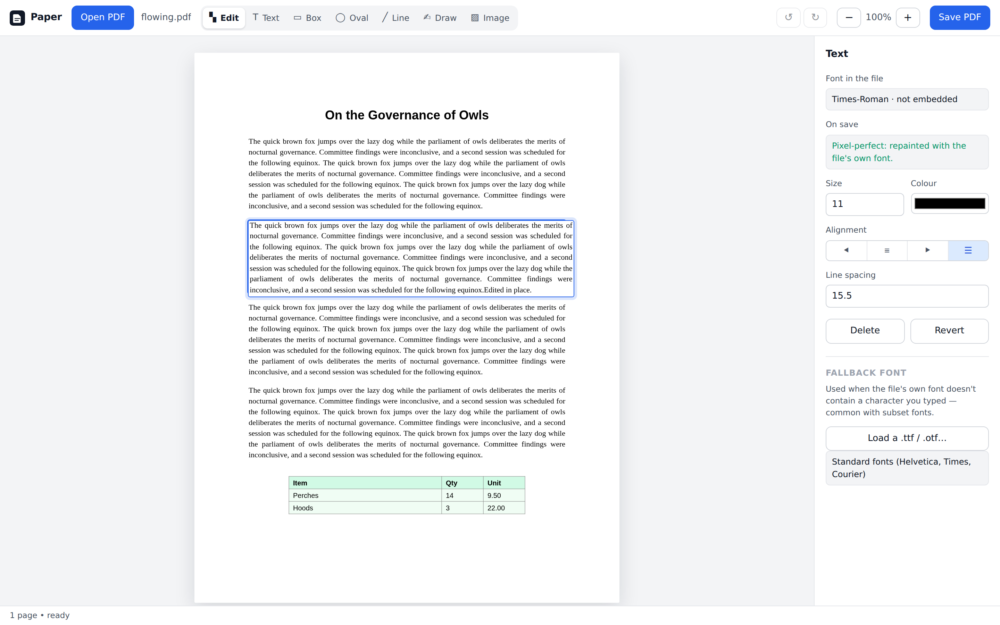

# paper-pdf

Paper PDF is a tool for editing your PDFs entirely in the browser. The editor supports adding, removing and editing text, plus support for basic shapes.

No backend server, payment or any login required. Don't tell Adobe.



## Quick start

**Use it:** https://weilonying.github.io/paper-pdf/

**Or run it locally:** download the repo or [download the latest release](https://github.com/WeilonYing/paper-pdf/releases), then double-click `index.html`. It's a static page running on pure JS. Your PDFs never leave your machine either way.

```bash
git clone https://github.com/WeilonYing/paper-pdf.git
```

## What it does

- Click text to edit it. Paragraphs re-wrap to the original column and keep their alignment,
  including justification.
- Delete text, and it's removed rather than covered.
- Table cells are separate blocks, so editing one doesn't wipe the row.
- Boxes, ovals, lines, freehand signatures, and PNG/JPEG stamps.
- New text boxes anywhere — click with the Text tool and type.
- Fill AcroForm fields.
- Undo/redo, per-block font, size, colour, alignment and line spacing.

The inspector tells you before you save whether a block will be repainted in the file's own font
(pixel-perfect) or substituted, and updates as you type. Load a `.ttf` as a fallback if the original
font lacks a character.

**Keys:** `V` edit · `T` text · `R` box · `O` oval · `L` line · `D` draw · `I` image ·
`Ctrl/⌘+Z` undo · `Ctrl/⌘+S` save · `Delete` remove · `Esc` deselect · `Ctrl/⌘+Enter` commit

## Limitations

- **No reflow.** Shorten a paragraph and the one below it stays put — nothing in a PDF knows it's
  below anything else.
- **Subset fonts** only contain the glyphs the document already used, so a new character may not be
  available. Load a fallback font, or accept the substitution.
- **Type 3 fonts** (old TeX bitmap output) are always substituted, never reused.
- **Scanned pages** have no editable text, just an invisible OCR layer over an image. Editing it
  won't change the picture. The app detects this and says so.
- **Encrypted PDFs** open, but the output drops the encryption.

## Development

No build step. Edit the files and reload.

```bash
npm start          # serve at localhost:8000
```

| File | Job |
| --- | --- |
| `js/lexer.js` | Content-stream tokeniser; records each operator's byte range |
| `js/fonts.js` | Widths, encodings, ToUnicode maps, and whether a font can be reused |
| `js/engine.js` | Walks the stream tracking graphics state; emits one run per text operator |
| `js/blocks.js` | Runs → lines → paragraphs, via marked-content IDs or geometry |
| `js/writer.js` | Splices the stream, compensates advances, repaints text |
| `js/app.js` | The UI |

Edits are recorded against the original bytes and replayed to build the preview, so undo is exact and
repeated editing never degrades the file. `window.Paper` exposes `blocks(0)`, `setText(id, text)` and
`build()` for driving it from the console.

Vendored libraries and how to upgrade them: `vendor/README.md`.

## Contributing

This tool came out of frustration at the lack of PDF editors that don't require an account,
a subscription or a non-trivial amount of setup. If you have ideas on how to make it better,
feel free to open an issue or a pull request. Or fork it, I don't mind.

## Tests

```bash
npm install && npx playwright install chromium
npm run fixtures   # generate the test PDFs
npm test
```

103 assertions in three suites — the engine against eight fixture PDFs, the UI under real mouse and
keyboard input, and the app running from `file://`. Details in `tests/README.md`.

## Licence

WTFPL. Vendored libraries keep their own; see `vendor/README.md`.
